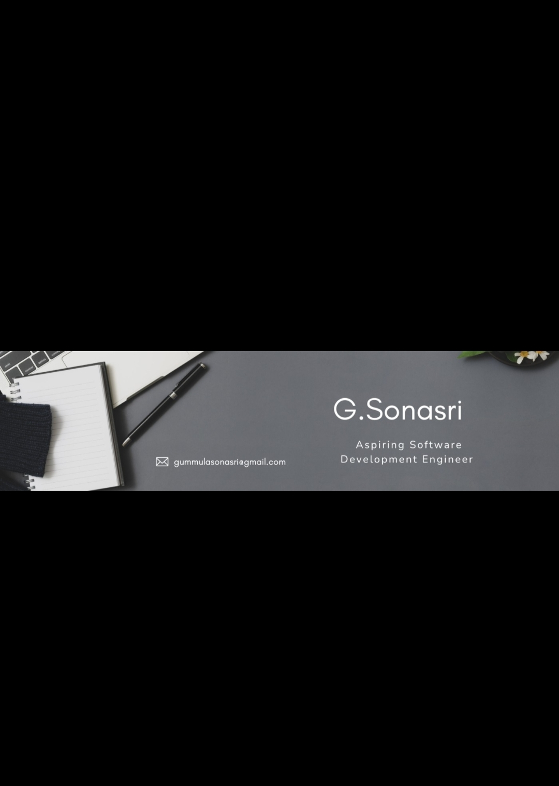

  

# Hi there 👋 I'm Sonasri

## 💻 Aspiring Software Development Engineer
SonaSri

My GitHub profile
 
Hi there 👋, I'm Sonasri
 💻 Aspiring Software Development Engineer
 🎓 B.Tech CSE Student

🚀 About Me

- 🌱 Currently in last stage of  Data Structures & Algorithms
- 📚 Learning System Design HLD(Basic) 
LLD completd
- 💻 Building Full Stack Projects using Flask
- 🎯 Goal: Become a Software Development Engineer

🛠️ Tech Stack

Languages
- Python
- Java
- SQL
- JavaScript

Frontend
- HTML
- CSS
- JavaScript

Backend
- Flask

Database
- MySQL
- Mongodb

Operating System 
- linux

Tools
- Git
- GitHub
- VS Code
- Docker
  ## 🛠️ Skills

Cs fundamentals 
- OOPs
- DBMS
- Operating Systems
- Computer Networks
## 📊 GitHub Stats

⭐ Thanks for visiting my profile!
